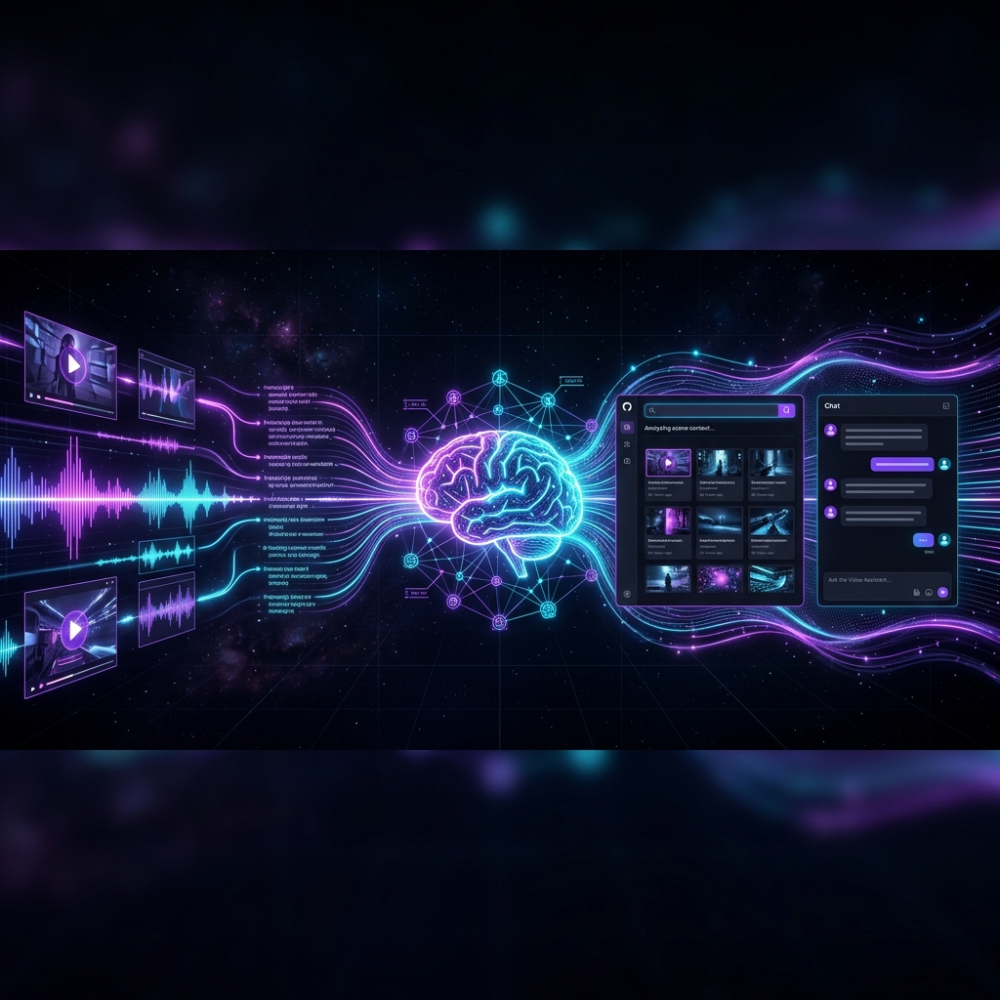
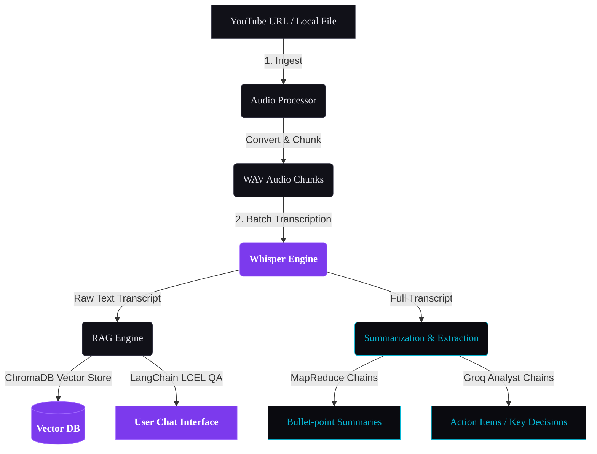
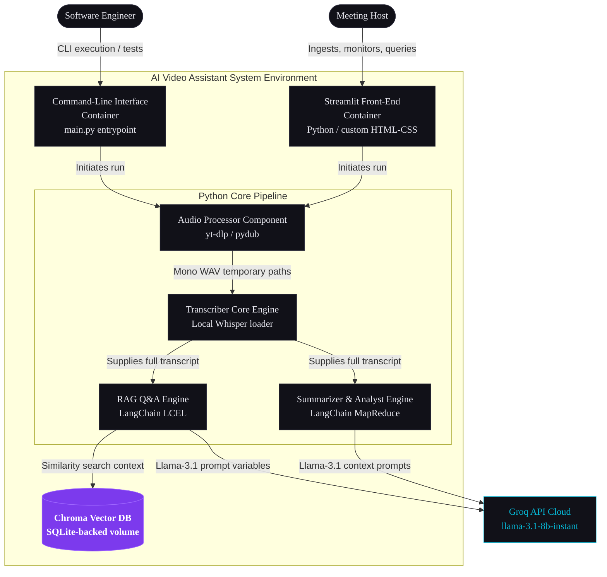
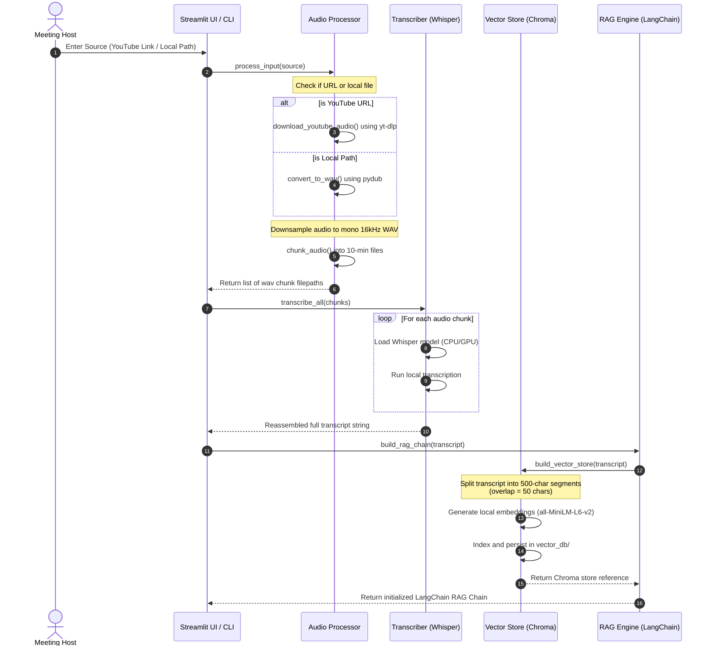
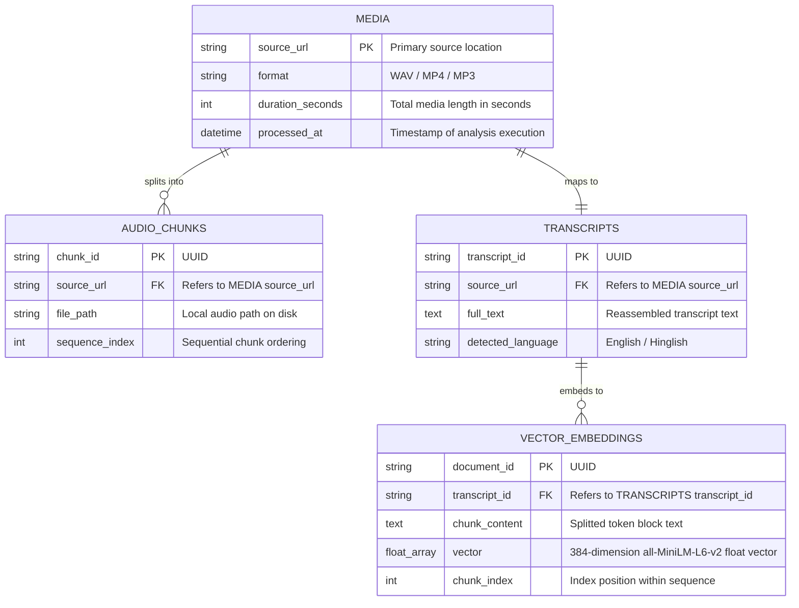
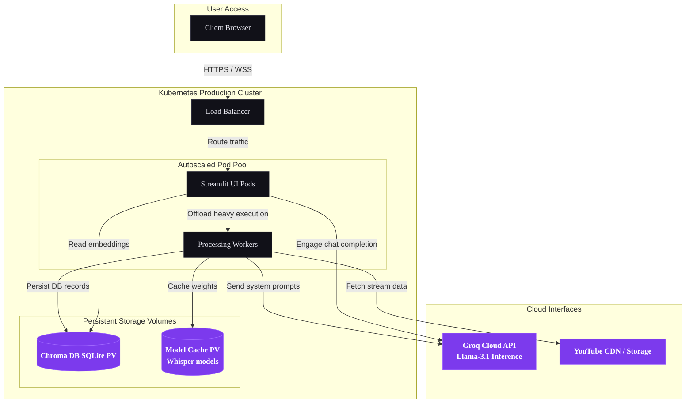
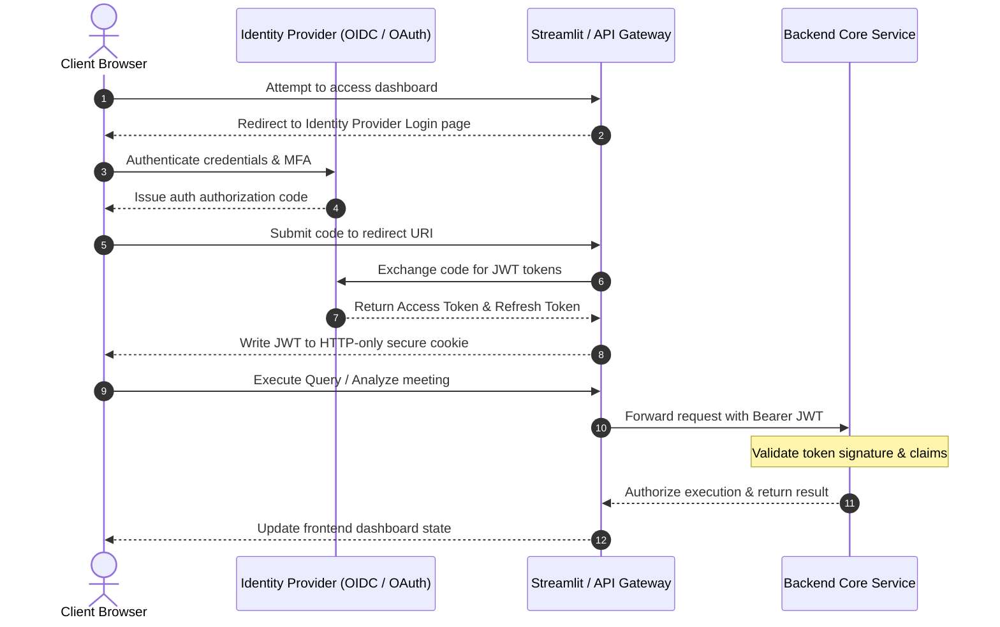
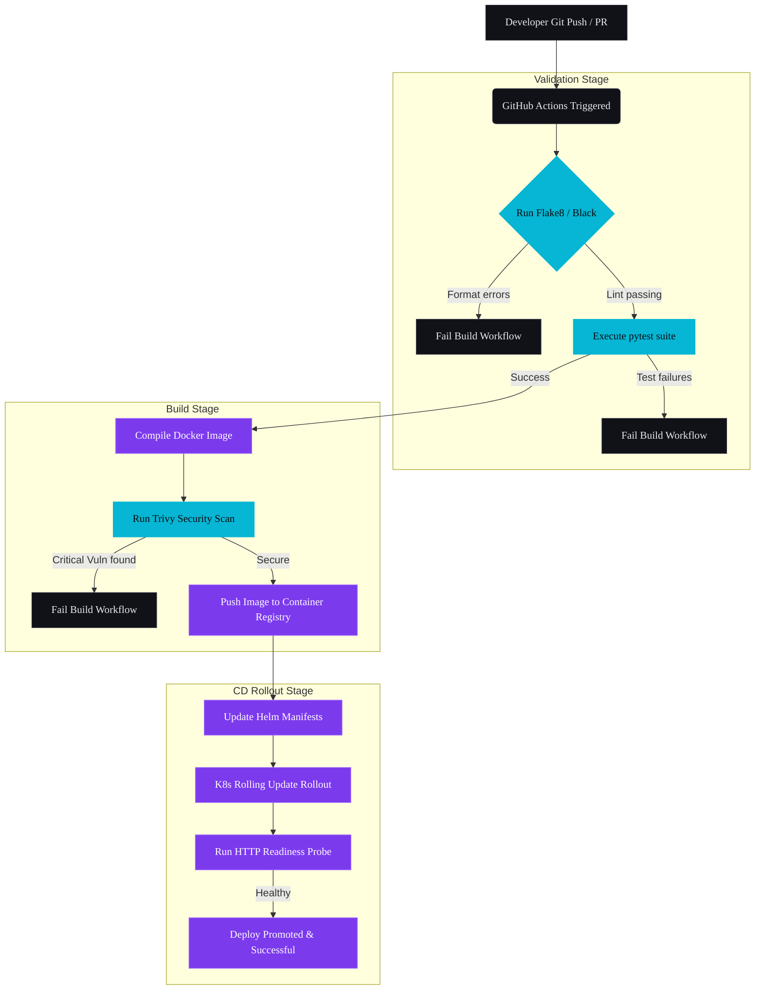
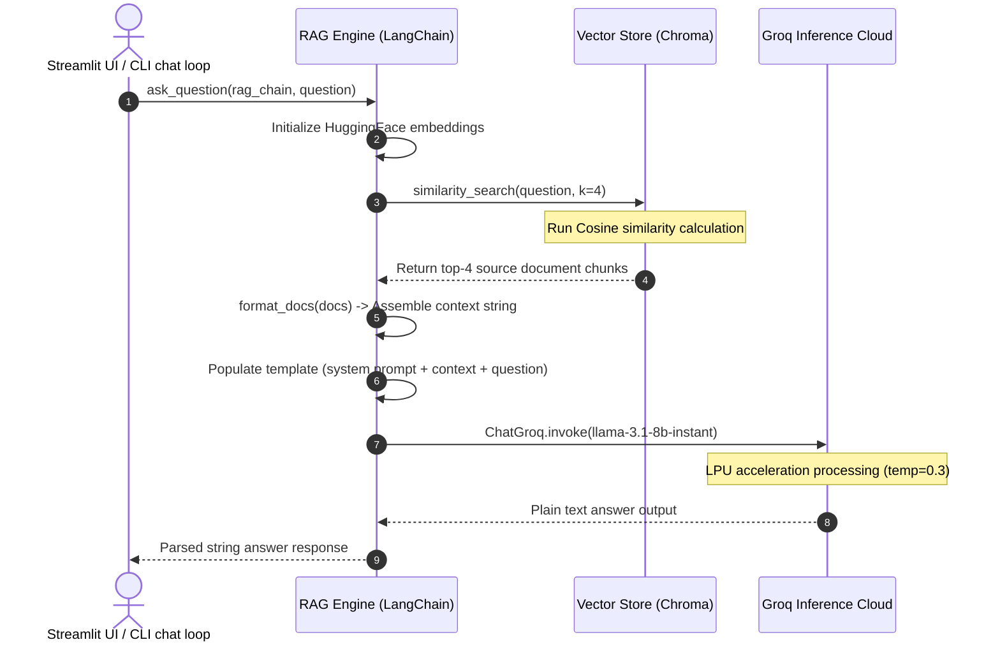
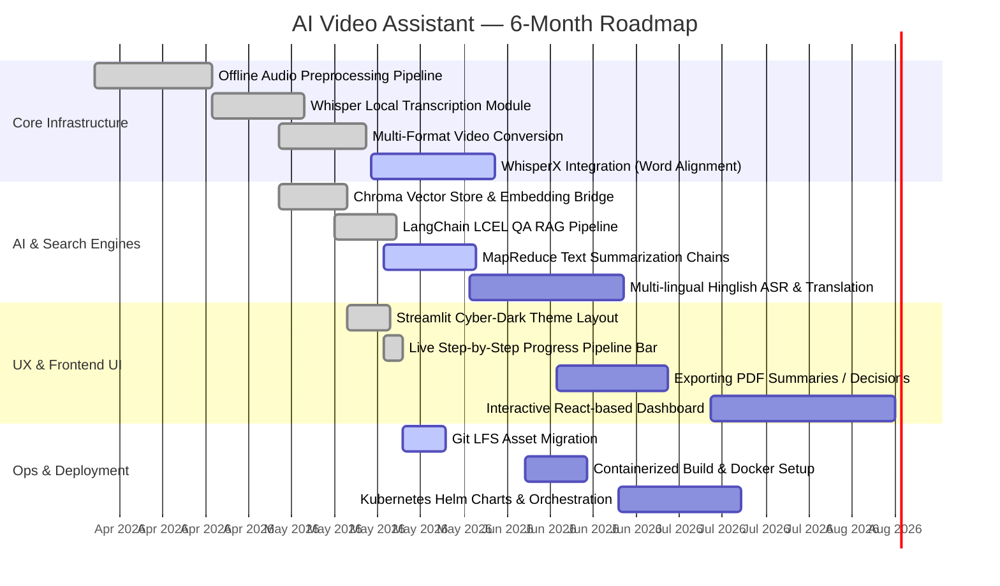

# 🎬 AI Video Assistant

<p align="center">
  
</p>

<p align="center">
  <!-- Glowing Custom Badge Row -->
  <a href="https://github.com/Ifrah27/AI-Video-Assistant/actions"></a>
  <a href="https://semver.org/"></a>
  <a href="LICENSE"></a>
  <a href="https://www.python.org/"></a>
  <a href="https://github.com/Ifrah27/AI-Video-Assistant/stargazers"></a>
</p>

<div align="center">
  <h3>⚡ Cinematic Knowledge Extraction & Interactive RAG for Video & Audio Meetings ⚡</h3>
  <p style="max-width: 800px; color: #7070a0; font-family: 'JetBrains Mono', monospace; font-size: 0.95rem; line-height: 1.6;">
    A production-grade intelligent pipeline that ingests long-form video/audio files or YouTube URLs, transcribes media locally with hardware-accelerated OpenAI Whisper, generates MapReduce bullet summaries, extracts action items and decisions via Groq inference, and indexes semantic segments in ChromaDB for instant, citation-grounded conversational Q&A.
  </p>
</div>

<!-- Section Wave Divider -->
<p align="center" style="margin-top: 40px; margin-bottom: 40px;">
  <svg width="100%" height="60" viewBox="0 0 1200 60" fill="none" xmlns="http://www.w3.org/2000/svg" preserveAspectRatio="none">
    <path d="M0 20C300 -10 600 50 900 20C1050 5 1150 0 1200 10V60H0V20Z" fill="url(#waveGrad)" opacity="0.15"/>
    <path d="M0 35C300 10 600 60 900 35C1050 20 1150 15 1200 25V60H0V35Z" fill="url(#waveGrad)" opacity="0.35"/>
    <path d="M0 50C300 25 600 70 900 50C1050 35 1150 30 1200 40V60H0V50Z" fill="url(#waveGrad)"/>
    <defs>
      <linearGradient id="waveGrad" x1="0" y1="0" x2="1200" y2="0" gradientUnits="userSpaceOnUse">
        <stop stop-color="#7c3aed"/>
        <stop offset="1" stop-color="#06b6d4"/>
      </linearGradient>
    </defs>
  </svg>
</p>

---

## ⚡ Core Architecture at a Glance

The AI Video Assistant coordinates three primary pipelines to extract actionable knowledge from rich media sources.



---

## 🚀 Key Features Grid

<table width="100%" style="border-collapse: collapse; border: none; font-family: 'JetBrains Mono', monospace;">
  <tr style="border: none;">
    <td width="50%" style="padding: 20px; border: 1px solid #2a2a3a; background: #111118; vertical-align: top; border-radius: 8px;">
      <p align="center">
        <!-- Ingestion Icon -->
        <svg width="48" height="48" viewBox="0 0 24 24" fill="none" stroke="#06b6d4" stroke-width="1.5" xmlns="http://www.w3.org/2000/svg">
          <path d="M21 15v4a2 2 0 0 1-2 2H5a2 2 0 0 1-2-2v-4M7 10l5 5 5-5M12 15V3" stroke-linecap="round" stroke-linejoin="round"/>
        </svg>
      </p>
      <h4 align="center" style="color: #ffffff; margin-top: 10px; font-family: 'Syne', sans-serif;">Flexible Media Ingestion</h4>
      <p style="color: #7070a0; font-size: 0.85rem; line-height: 1.5; margin-bottom: 0;">
        Downloads YouTube videos on the fly utilizing <code>yt-dlp</code> or extracts audio from local files. Conforms sample rates to mono 16kHz WAV format using <code>pydub</code> to maximize Whisper output accuracy.
      </p>
    </td>
    <td width="50%" style="padding: 20px; border: 1px solid #2a2a3a; background: #111118; vertical-align: top; border-radius: 8px;">
      <p align="center">
        <!-- Whisper ASR Icon -->
        <svg width="48" height="48" viewBox="0 0 24 24" fill="none" stroke="#7c3aed" stroke-width="1.5" xmlns="http://www.w3.org/2000/svg">
          <path d="M12 2a3 3 0 0 0-3 3v7a3 3 0 0 0 6 0V5a3 3 0 0 0-3-3z" stroke-linecap="round" stroke-linejoin="round"/>
          <path d="M19 10v1a7 7 0 0 1-14 0v-1M12 19v3M8 22h8" stroke-linecap="round" stroke-linejoin="round"/>
        </svg>
      </p>
      <h4 align="center" style="color: #ffffff; margin-top: 10px; font-family: 'Syne', sans-serif;">Local ASR Transcription</h4>
      <p style="color: #7070a0; font-size: 0.85rem; line-height: 1.5; margin-bottom: 0;">
        Performs fully local transcription utilizing OpenAI's Whisper model (configurable via <code>.env</code> from <code>tiny</code> to <code>large</code>). Audio splitting prevents GPU memory overflow on long sessions.
      </p>
    </td>
  </tr>
  <tr style="border: none;">
    <td width="50%" style="padding: 20px; border: 1px solid #2a2a3a; background: #111118; vertical-align: top; border-radius: 8px;">
      <p align="center">
        <!-- Summarization Icon -->
        <svg width="48" height="48" viewBox="0 0 24 24" fill="none" stroke="#7c3aed" stroke-width="1.5" xmlns="http://www.w3.org/2000/svg">
          <path d="M14 2H6a2 2 0 0 0-2 2v16a2 2 0 0 0 2 2h12a2 2 0 0 0 2-2V8z" stroke-linecap="round" stroke-linejoin="round"/>
          <polyline points="14 2 14 8 20 8" stroke-linecap="round" stroke-linejoin="round"/>
          <line x1="16" y1="13" x2="8" y2="13" stroke-linecap="round" stroke-linejoin="round"/>
          <line x1="16" y1="17" x2="8" y2="17" stroke-linecap="round" stroke-linejoin="round"/>
          <polyline points="10 9 9 9 8 9" stroke-linecap="round" stroke-linejoin="round"/>
        </svg>
      </p>
      <h4 align="center" style="color: #ffffff; margin-top: 10px; font-family: 'Syne', sans-serif;">MapReduce Summarization</h4>
      <p style="color: #7070a0; font-size: 0.85rem; line-height: 1.5; margin-bottom: 0;">
        Leverages Groq's high-speed inference cloud to run a multi-stage MapReduce summarization chain, enabling massive hours-long meetings to be condensed into structured, bulleted summaries without context window overflow.
      </p>
    </td>
    <td width="50%" style="padding: 20px; border: 1px solid #2a2a3a; background: #111118; vertical-align: top; border-radius: 8px;">
      <p align="center">
        <!-- RAG Chat Icon -->
        <svg width="48" height="48" viewBox="0 0 24 24" fill="none" stroke="#06b6d4" stroke-width="1.5" xmlns="http://www.w3.org/2000/svg">
          <path d="M21 15a2 2 0 0 1-2 2H7l-4 4V5a2 2 0 0 1 2-2h14a2 2 0 0 1 2 2z" stroke-linecap="round" stroke-linejoin="round"/>
        </svg>
      </p>
      <h4 align="center" style="color: #ffffff; margin-top: 10px; font-family: 'Syne', sans-serif;">Interactive RAG Engine</h4>
      <p style="color: #7070a0; font-size: 0.85rem; line-height: 1.5; margin-bottom: 0;">
        Indexes session text in ChromaDB with HuggingFace's <code>all-MiniLM-L6-v2</code> local embeddings. Supports interactive chat with conversational memory using LangChain LCEL and Groq's <code>llama-3.1-8b-instant</code>.
      </p>
    </td>
  </tr>
</table>

---

## 📖 Interactive Live Demo & Experience

<details>
<summary style="font-size: 1.15rem; font-weight: bold; color: #06b6d4; cursor: pointer; padding: 10px; border: 1px solid #2a2a3a; border-radius: 6px; background: #111118; font-family: 'Syne', sans-serif;">
  🎬 Click to expand stream session demo
</summary>

<div style="padding: 15px; background: #0a0a0f; border: 1px solid #2a2a3a; border-top: none; border-radius: 0 0 6px 6px;">
  <p align="center" style="color: #7070a0; font-size: 0.85rem; font-family: 'JetBrains Mono', monospace;">
    The dashboard features a live pipeline status tracker that lights up step-by-step as audio is processed, transcribed, and indexed.
  </p>
  <p align="center">
    
  </p>
  
  <table width="100%" style="border-collapse: collapse; border: none; font-size: 0.8rem; font-family: 'JetBrains Mono'; margin-top: 15px;">
    <tr>
      <td width="33%" align="center" style="border: 1px solid #2a2a3a; padding: 10px; background: #111118;">
        <br/>
        <strong>1. Ingestion Control</strong>
      </td>
      <td width="33%" align="center" style="border: 1px solid #2a2a3a; padding: 10px; background: #111118;">
        <br/>
        <strong>2. Structured Extraction</strong>
      </td>
      <td width="33%" align="center" style="border: 1px solid #2a2a3a; padding: 10px; background: #111118;">
        <br/>
        <strong>3. Contextual Chat</strong>
      </td>
    </tr>
  </table>
</div>
</details>

<!-- Section Wave Divider -->
<p align="center" style="margin-top: 40px; margin-bottom: 40px;">
  <svg width="100%" height="60" viewBox="0 0 1200 60" fill="none" xmlns="http://www.w3.org/2000/svg" preserveAspectRatio="none">
    <path d="M1200 30C900 60 600 0 300 30C150 45 50 50 0 40V0H1200V30Z" fill="url(#waveGrad)" opacity="0.15"/>
    <path d="M1200 15C900 40 600 0 300 15C150 25 50 30 0 20V0H1200V15Z" fill="url(#waveGrad)" opacity="0.35"/>
    <path d="M1200 0C900 20 600 0 300 0C150 0 50 0 0 0V0H1200V0Z" fill="url(#waveGrad)"/>
  </svg>
</p>

---

## 🛠️ Detailed Technical Architecture Diagrams

These detailed systems diagrams outline the design of the AI Video Assistant's processing layers, containers, data flows, and build deployments.

### 1. C4 Container Diagram (Level 2)
Describes the software boundaries, system APIs, vector indices, and third-party models involved in the execution environment.



---

### 2. Execution Sequence Diagram: Ingestion to Indexing
Demonstrates the sequence of events that take place when a user triggers media ingestion.



---

### 3. Entity-Relationship (ER) Metadata Schema
Defines the relational storage structure and metadata relationships managed by the assistant.



---

### 4. Deployment & Cloud Topology
Demonstrates a production-grade Kubernetes-based cluster deployment of the Video Assistant.



---

### 5. JWT & OAuth authentication flow
Highlights the flow for securing the frontend and verifying user API actions.



---

### 6. Continuous Integration & Deployment Pipeline
Illustrates the automated testing, building, scanning, and container promotion cycle.



---

### 7. RAG API Request-Response Lifecycle
Highlights the interaction flow during a user RAG query chat turn.



---

### 8. 6-Month Release Roadmap
Tracks milestone achievements and feature planning for the AI Video Assistant.



---

## 📂 Project Repository Tree

Below is the directory architecture detailing core pipeline components, utilities, and static assets.

```
.
├── app.py                 # Streamlit Cyber-Dark Dashboard entrypoint
├── main.py                # Command-line CLI pipeline runner & interactive chat
├── test.py                # Pipeline integration verification script
├── Requirements.txt       # Project python dependencies
├── .env                   # Configuration file (environment keys)
├── core/
│   ├── extractor.py       # Groq-based action items, decisions & questions parser
│   ├── rag_engine.py      # LangChain LCEL RAG chain pipeline logic
│   ├── summarizer.py      # MapReduce summarizer & title generator
│   ├── transcriber.py     # Local Whisper model manager & transcriber
│   └── vector_store.py    # HuggingFace embedding manager & Chroma loader
├── utils/
│   └── audio_processor.py # YouTube downloader (yt-dlp) & format converter (pydub)
└── assets/
    └── hero_banner.png    # Cinematic high-fidelity project banner
```

<!-- Section Wave Divider -->
<p align="center" style="margin-top: 40px; margin-bottom: 40px;">
  <svg width="100%" height="60" viewBox="0 0 1200 60" fill="none" xmlns="http://www.w3.org/2000/svg" preserveAspectRatio="none">
    <path d="M0 20C300 -10 600 50 900 20C1050 5 1150 0 1200 10V60H0V20Z" fill="url(#waveGrad)" opacity="0.15"/>
    <path d="M0 35C300 10 600 60 900 35C1050 20 1150 15 1200 25V60H0V35Z" fill="url(#waveGrad)" opacity="0.35"/>
    <path d="M0 50C300 25 600 70 900 50C1050 35 1150 30 1200 40V60H0V50Z" fill="url(#waveGrad)"/>
  </svg>
</p>

---

## ⚙️ Installation & Setup

### 1. System Requirements & External Binaries
Because the system converts media formats using `pydub` and downloads streams, you must install **FFmpeg** on your local machine:
- **macOS**: `brew install ffmpeg`
- **Linux**: `sudo apt-get install ffmpeg`
- **Windows**: Download binaries via [Gyan.dev](https://www.gyan.dev/ffmpeg/builds/) and append to your system PATH.

### 2. Environment Variables Configuration
Create a `.env` file in the root directory to populate required service keys:

| Parameter | Default | Purpose |
| :--- | :--- | :--- |
| `GROQ_API_KEY` | *Required* | API key for high-speed Llama-3.1 summaries and RAG chat. |
| `WHISPER_MODEL` | `base` | Model tier for local transcribing (`tiny`, `base`, `small`, `medium`, `large`). |
| `OPENAI_API_KEY` | *Optional* | Fallback embeddings provider API key. |

*Sample `.env` template:*
```ini
GROQ_API_KEY=gsk_your_api_key_here
WHISPER_MODEL=base
```

### 3. Installation Steps
Clone the project, set up a virtual environment, and install dependencies:
```bash
# Clone the repository
git clone https://github.com/Ifrah27/AI-Video-Assistant.git
cd AI-Video-Assistant

# Create virtual environment
python -m venv .venv

# Activate virtual environment
# On Windows PowerShell:
.venv\Scripts\Activate.ps1
# On Linux / macOS:
source .venv/bin/activate

# Install package dependencies
pip install -r Requirements.txt
```

---

## 🎮 Running the Application

### Option A: Streamlit Cyber-Dark UI Dashboard (Recommended)
Launch the responsive UI to configure pipeline targets visually:
```bash
streamlit run app.py
```
*Navigate to `http://localhost:8501` to use the dashboard.*

### Option B: Terminal CLI Interface
Run the end-to-end pipeline and query the RAG chain directly from your terminal shell:
```bash
python main.py
```
*Prompts will request your YouTube URL/filepath and output summarized markdown lists.*

---

## 📡 API Specification Reference

For web clients looking to interface with the core Python service layer:

### Ingest & Process Media
`POST /api/process`
- **Request Headers**: `Content-Type: application/json`
- **Request Body**:
```json
{
  "source": "https://www.youtube.com/watch?v=example",
  "language": "english"
}
```
- **Success Response (202 Accepted)**:
```json
{
  "job_id": "job_98fa2210a4",
  "status": "processing",
  "steps": {
    "audio": "active",
    "transcript": "pending",
    "indexing": "pending"
  }
}
```

### Submit Query to Session RAG
`POST /api/query`
- **Request Headers**: `Content-Type: application/json`, `Authorization: Bearer <JWT_TOKEN>`
- **Request Body**:
```json
{
  "job_id": "job_98fa2210a4",
  "question": "What key deadlines were established during the sync?",
  "k": 4
}
```
- **Success Response (200 OK)**:
```json
{
  "answer": "The team agreed to deploy the beta version on Friday, June 12th. Speaker Sarah will finalize the schema design by Wednesday.",
  "sources": [
    {
      "chunk_index": 2,
      "text_snippet": "...deploy the beta version on Friday, June 12th..."
    }
  ]
}
```

---

## 🔒 Security & Privacy Practices

- **Local Processing First**: High-risk media files are processed locally. Whisper speech-to-text models compile audio files on your local CPU/GPU, ensuring zero voice data leakages to third-party APIs.
- **Short-Lived Keys**: Groq API queries use brief payloads that are not retained or utilized for public model training.
- **Git Protections**: The `.gitignore` prevents local model caches, temporary downloaded audio chunks, and Chroma vector database SQLite binary tables from being pushed to source control.

---

## 🤝 Contributing Workflow

We welcome contributions! Please follow this branch hierarchy:
- **`main`**: Production release branch (protected).
- **`develop`**: Standard integration branch where features are compiled.
- **`feature/*`**: Dedicated branches for individual changes.

```
Developer Work ---> Fork/Branch ---> PR to develop ---> CI Lint/Test Verify ---> Approval ---> Merge
```
*Please open an issue first to discuss large refactoring tasks.*

---

<p align="center" style="color: #7070a0; font-family: 'JetBrains Mono', monospace; font-size: 0.8rem; margin-top: 40px;">
  Made with 💜 for engineers • © 2026 AI Video Assistant • License: MIT
</p>
